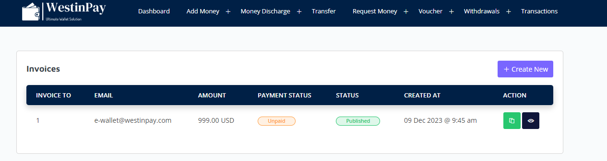

# WestinPay Creating a WestinPay Invoice and creating a connection link.
<a href="https://westinpay.com/invoice/payment/eyJpdiI6IjdQV2l3ZVlFbGNXLzFaa1RsaHA0SUE9PSIsInZhbHVlIjoiSXVRa21FUzVYNFowOFBLbEtUWjZBayt6T1ZKd0ZlYWpZdzdFV0phK0hJbz0iLCJtYWMiOiIxMjQzYWYxYjQ5MzEzYzdiZGY4OTFhMWNkNzZlMjg0OGJlOWVmYTczZmM2OWM1NGE4MjRjMDIxMDk0ZDE1YzMyIiwidGFnIjoiIn0=)https://westinpay.com/invoice/payment/eyJpdiI6IjdQV2l3ZVlFbGNXLzFaa1RsaHA0SUE9PSIsInZhbHVlIjoiSXVRa21FUzVYNFowOFBLbEtUWjZBayt6T1ZKd0ZlYWpZdzdFV0phK0hJbz0iLCJtYWMiOiIxMjQzYWYxYjQ5MzEzYzdiZGY4OTFhMWNkNzZlMjg0OGJlOWVmYTczZmM2OWM1NGE4MjRjMDIxMDk0ZDE1YzMyIiwidGFnIjoiIn0=">Test Link</a>

# Connection test.

